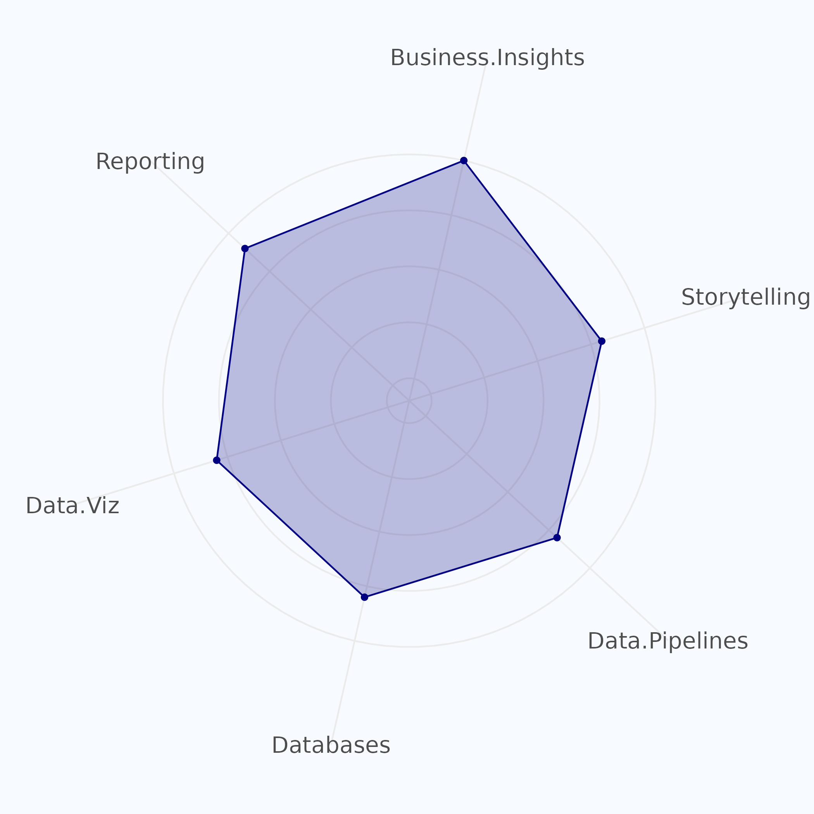

```{r, include=FALSE}
knitr::opts_chunk$set(
  results='asis', 
  echo = FALSE
)

library(magrittr) # For the pipe
library(dplyr)
library(tidyr)
library(forcats)
library(ggplot2)
source("CV_printing_functions.R")

# Read in all data and initialize a CV printer object
# CV <- create_CV_object(
#   data_location = "https://docs.google.com/spreadsheets/d/14MQICF2F8-vf8CKPF1m4lyGKO6_thG-4aSwat1e2TWc",  
#   pdf_mode = params$pdf_mode,
#   cache_data = params$cache_data
# )

CV <- readr::read_rds('cached_positions.rds')

```


```{r}
# When in pdf export mode the little dots are unaligned, so fix that with some conditional CSS.
if(params$pdf_mode) {
    cat("
<style>
:root{
  --decorator-outer-offset-left: -6.5px;
}
</style>")
}
```


Aside
================================================================================

```{r message=FALSE, warning=FALSE, paged.print=FALSE}
# Build interactive network of positions colored by section
# and connected if they occurred in the same year
#datadrivencv::build_network_logo(CV$entries_data)
# Create the data
data <- data.frame(
  "Type of Data Professional" = "Data Architect",
  "Data Modelling" = 9,
    "Reporting" = 8,
  "Cloud Experience" = 8,
  
  "Data Engineering" = 8,
  "Business Acumen" = 8,
  "Automation" = 9
  #"Experimentation" = 2,
  #"Stats" = 3,
 # "ML Deployment" = 6
)

data_prep_tbl <- data %>%
  rename(type = 1) %>%
  pivot_longer(
    cols = -type
  ) %>%
  mutate(
    type = as_factor(type),
    name = as_factor(name)
  )

# The trick
coord_radar <- function (theta = "x", start = 0, direction = 1, clip = "on") {
  theta <- match.arg(theta, c("x", "y"))
  r <- if (theta == "x") "y" else "x"
  ggproto("CordRadar", CoordPolar, theta = theta, r = r, start = start,
          direction = sign(direction), clip = clip,
          is_linear = function(coord) TRUE)
}

# Creating the radar plot
basic_radar_plot <- data_prep_tbl %>%
  ggplot(aes(name, value, group = type)) +
  geom_polygon(aes(fill = type, color = type), alpha = 0.25) +
  geom_point(aes(color = type)) + 
  scale_y_continuous(limits = c(-1, 13), breaks = c(0, 2.5, 5, 7.5, 10)) +
  coord_radar(start = -0.3, clip = "off")

# Apply styling and additional theming
styled_plot <- basic_radar_plot +
  theme_minimal() +
  scale_fill_manual(values = c("navyblue")) +
  scale_color_manual(values = c("navyblue")) +
  labs(
    legend = NULL,
    x = NULL,
    y = NULL
  ) +
  theme(
    plot.background = element_rect(fill = "#F7FBFF", color = NA),  # Set background color and remove border
    panel.border = element_blank(),  # Remove panel border around the entire plot
    legend.position = "none",
    axis.text.y = element_blank(),
    axis.text.x = element_text(
      vjust = -1,
      size = 14
    ),
    panel.spacing = unit(50, "points"),
    panel.grid.minor = element_blank(),
    panel.grid.major.y = element_line(colour = c(rep("#ebebeb", 5), NA)),
    axis.text = element_text(size = 18)
  )

# Save the plot with width set to 
ggsave("radar_plot.png", styled_plot, width = 7, height = 7)
```



```{r}
if(params$pdf_mode){
  cat("View online <i class='fas fa-globe'></i> at [dar4datascience.github.io](https://dar4datascience.github.io/Curriculum-Vitae/)")
} else {
  cat("[<i class='fas fa-download'></i> Download a PDF of this CV](https://raw.githubusercontent.com/dar4datascience/Curriculum-Vitae/main/dar_cv.pdf) ")
}

```

```{r}

cat("See the full list of my <i class='fa-solid fa-school'></i> certifications in  <i class='fa-brands fa-linkedin'></i> @[dar-4-ds/details/certifications/](https://www.linkedin.com/in/dar-4-ds/details/certifications/) and <i class='fa-brands fa-google'></i> @[cloudskillsboost](https://www.cloudskillsboost.google/public_profiles/c4664f93-2fd2-446c-a4bc-5a3bf1b35a26).")
```


Contact {#contact}
--------------------------------------------------------------------------------

```{r}
CV %>% print_contact_info()
```


Tech Skills {#skills data-icon=globe}
--------------------------------------------------------------------------------

```{r}
CV %>% print_skill_bars()
```


Disclaimer {#disclaimer}
--------------------------------------------------------------------------------

Last updated on `r Sys.Date()`.


Main
================================================================================

Daniel Amieva Rodriguez {#title}
--------------------------------------------------------------------------------

```{r}
# Note the special double pipe so we modify the CV object in place
CV %<>% print_text_block("intro") 
```

Relevant Industry Experience {data-icon=industry}
--------------------------------------------------------------------------------

```{r}
CV %<>% print_section('industry_positions')
```


Relevant Education {data-icon=university data-concise=true}
--------------------------------------------------------------------------------

```{r}
CV %<>% print_section('education')
```


<!-- These breaks just force a new page so section doesnt get cut off -->
<br>
<br>
<br>

```{r}
CV %<>% print_links()
```

