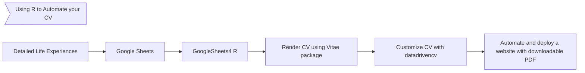

# CV

Repository for automating CV generation on-demand.

## Workflow

## Assets

 - CV in pdf
 - Scripts
 - README

## References

 - [Data driven CVs](https://github.com/nstrayer/datadrivencv)
 - [Vitae Package].....
 - [Tutorial of Vitae by the Author NAME....].....
 - [R Ladies Meetup about the datadrivencv package]()
