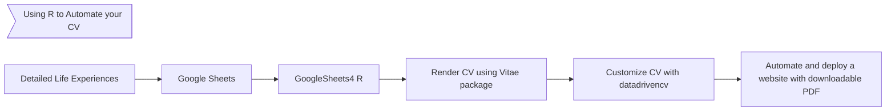

# Auto CV

## Pending

 - updating gihtug pages
 - github action deployment

## Overview 

Repository for automating CV generation on-demand.

BROKEN HERE....
You can see the lastest version of my CV @[this github pages link](https://dar4datascience.github.io/Curriculum-Vitae/)

## Objective

Simplify the CV generation process by linking a live Google Sheets with the complete information into a process that curates the data and publishes that information into handy formats.

## Workflow

## Assets

 - CV in pdf
 - CV as an html
 - R Scripts
 - css file
 - README

## References

 - [CV Quarto Template](https://github.com/schochastics/classic-cv)