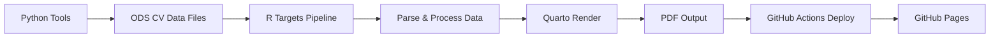

# Auto CV

## Overview 

Automated CV generation pipeline using ODS files, R targets, and Quarto. Updates are deployed automatically to GitHub Pages via GitHub Actions.

**Latest CV**: [https://dar4datascience.github.io/Curriculum-Vitae/](https://dar4datascience.github.io/Curriculum-Vitae/)

## Workflow


```mermaid
  graph LR;
      A[ODS CV Data Files]-->B[R Targets Pipeline];
      B-->C[Parse & Process Data];
      C-->D[Quarto Render];
      D-->E[PDF Output];
      E-->F[GitHub Actions Deploy];
      F-->G[GitHub Pages];
      H[Python Tools]-->A;
```

## Quick Start

### Update CV and Regenerate PDF

```bash
# 1. Update CV data (Python)
cd scripts
python cv_ods_manager.py --file "../cv types/dar_cv_engineer_short.ods" --add-work

# 2. Regenerate PDF (R)
cd ..
Rscript -e "targets::tar_make()"

# 3. Deploy
git add . && git commit -m "Update CV" && git push
```

See [`.windsurf/workflows/update-cv.md`](.windsurf/workflows/update-cv.md) for detailed workflow.

## File Structure

### CV Data Files (`cv types/`)
- **`dar_cv_engineer_short.ods`** - Main short CV (currently used)
- **`dar_cv_engineer.ods`** - Full engineer CV
- **`dar_cv_ai_engineer_short.ods`** - AI engineer focused CV

Each ODS file contains 4 sheets:
1. **entries** - Work experience and education
2. **language_skills** - Language proficiency  
3. **text_blocks** - General title and summary
4. **contact_info** - Contact information

### Python Tools (`scripts/`)

**CV Management:**
- **`cv_ods_manager.py`** - Read/write ODS files, add work entries programmatically
- **`add_teamstation_entry.py`** - Pre-configured script for latest work entry

**GitHub Repository Database:**
- **`fetch_github_repos.py`** - Scrapes GitHub repos, creates SQLite DB with skills categorization
- **`query_repos.py`** - Query tool for finding relevant projects by language, topics, keywords
- **`github_repos.db`** - SQLite database of all repos
- **`github_repos.json`** - JSON export of repo data

### R Pipeline

**Main Pipeline:**
- **`_targets.R`** - Targets pipeline definition
- **`R/ods_parse_information.R`** - ODS parsing functions
- **`R/render_quarto_cv.R`** - Quarto rendering functions

**Template:**
- **`AutoCV.qmd`** - Quarto template using classic-cv-pdf format

**Output:**
- **`danielamievarodriguez_cv.pdf`** - Generated CV

### Deployment
- **`.github/publish.yml`** - GitHub Actions workflow for automatic deployment to gh-pages

## Python Tools Usage

### CV Manager
```bash
cd scripts

# Add work entry interactively
python cv_ods_manager.py --file "../cv types/dar_cv_engineer_short.ods" --add-work

# Inspect ODS structure
python cv_ods_manager.py --file "../cv types/dar_cv_engineer_short.ods" --inspect

# View current entries
python cv_ods_manager.py --file "../cv types/dar_cv_engineer_short.ods" --show-entries
```

### GitHub Repository Database
```bash
cd scripts

# Build database
python fetch_github_repos.py

# Query by technology
python query_repos.py --topics "aws,data-engineering,python"

# Generate CV skills list
python query_repos.py --cv-skills --categories "Cloud & AWS,Data Engineering,AI & ML"

# Search projects
python query_repos.py --search "pipeline"
```

## Tech Stack

- **Data Storage**: ODS (LibreOffice Calc)
- **Pipeline**: R targets, renv
- **Rendering**: Quarto
- **Template**: [classic-cv](https://github.com/schochastics/classic-cv)
- **Python Tools**: pandas, ezodf, lxml, requests
- **Deployment**: GitHub Actions → GitHub Pages

## References

- [CV Quarto Template](https://github.com/schochastics/classic-cv)
- [R targets package](https://docs.ropensci.org/targets/)
- [Quarto Documentation](https://quarto.org/)